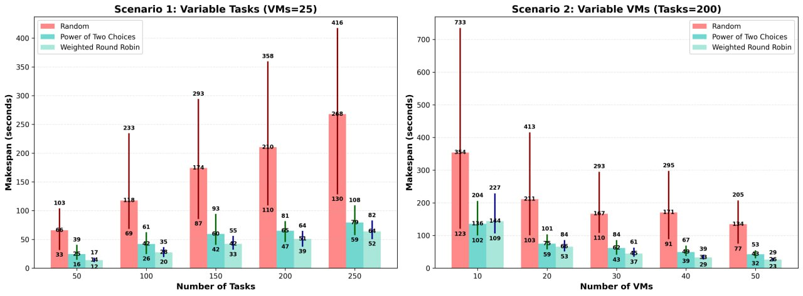

# ☁️ Cloud Task Scheduling Simulation and Benchmarking

A Python-based simulation framework that compares three task scheduling algorithms **Random Scheduling**, **Power of Two Choices**, and **Weighted Round Robin** for efficient task allocation across heterogeneous Virtual Machines (VMs) in cloud environments, with the goal of minimizing **makespan**.

---

## 📌 Table of Contents

- [Overview](#overview)
- [Algorithms](#algorithms)
- [Requirements](#requirements)
- [Configuration](#configuration)
- [Results](#results)

---

## 📖 Overview

Task scheduling is a fundamental challenge in cloud computing environments, especially when Virtual Machines (VMs) have heterogeneous processing capacities. Inefficient scheduling can lead to load imbalance and increased execution time.

This project simulates a cloud environment and evaluates three heuristic-based scheduling strategies under different workload and infrastructure configurations. The main objective is to **minimize makespan**, defined as the maximum completion time among all VMs.

---

## ⚙️ Algorithms

| Algorithm | Description |
|---------|-------------|
| **Random Scheduling** | Assigns each task to a randomly selected VM without considering current load |
| **Power of Two Choices (Po2C)** | Selects two random VMs and assigns the task to the one with lower worklo |
| **Weighted Round Robin (WRR)** | Distributes tasks based on VM capacity and dynamically adjusted weights |

---

## ⚙️ Requirements

- Python 3.8+
- Required libraries:
```bash
  pip install numpy pandas matplotlib openpyxl
```
---
## 🔧 Configuration

You can modify the following parameters in the source code to evaluate different experimental scenarios:

- **`NUM_TASKS`** – Number of tasks in the workload  
- **`NUM_VMS`** – Number of available Virtual Machines  
- **`TASK_SIZE_RANGE`** – Minimum and maximum task execution time  
- **`VM_CAPACITY_RANGE`** – Processing capacity range of VMs  
- **`NUM_RUNS`** – Number of repetitions per experiment  

> 💡 Changing these parameters allows you to test scalability, performance, and robustness of the scheduling algorithms under different workload and resource configurations.
  
---
# 📊 Results

### Makespan Comparison

The following figure shows the convergence behavior of the algorithm:



> 📌 The image is located in the root directory of this repository.

---
### Contact me

 * *[Email](mailto:mrsoheibkiani@gmail.com)*
 * *[Linkedin](https://www.linkedin.com/in/soheibkiani/)*
